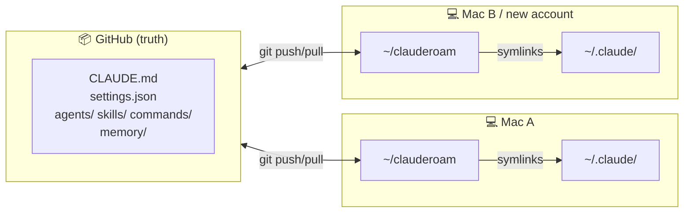

<div align="center">

# clauderoam

**Your Claude Code config, anywhere. Across Macs. Across accounts.**

[](LICENSE)
[](clauderoam)
[]()
[]()

[中文](./README.zh-CN.md) · [Docs](./docs) · [Examples](./examples)

</div>

---

Claude Code's `~/.claude/` directory holds everything you've customized — your `CLAUDE.md`, your subagents, your slash commands, your auto-memory. Switch Macs and it's gone. Switch Claude accounts and it's gone.

**clauderoam puts the portable parts in git, symlinks them back, and lets you roam.**

## Install

```bash
git clone https://github.com/YunyueLi/clauderoam.git ~/clauderoam
cd ~/clauderoam && ./clauderoam init
```

That's the whole setup. `init` personalizes your `CLAUDE.md` and links everything into `~/.claude/`. Restart Claude Code and your preferences are live.

On a second device, same two lines.

## How it works



Claude Code reads `~/.claude/` as usual — it doesn't know (or care) the files are symlinks. Switching accounts only replaces `.credentials.json`; everything else stays put.

## Commands

| Command | What it does |
|---|---|
| `clauderoam init` | Interactive setup — personalize `CLAUDE.md` and install symlinks |
| `clauderoam install` | (Re-)create the symlinks. Always backs up first. |
| `clauderoam doctor` | Verify symlinks point right and no secrets are tracked |
| `clauderoam sync` | Snapshot `~/.claude/projects/*/memory/` into `./memory/` |
| `clauderoam restore` | Restore memory snapshots (rewrites usernames across machines) |
| `clauderoam push` | `sync` + `git commit` + `git push` |
| `clauderoam status` | Show repo state and current symlinks |

Run `clauderoam help` for the full list.

## What's portable

| Synced to git | Stays on the machine |
|---|---|
| `CLAUDE.md` · `settings.json` | `.credentials.json` |
| `agents/` · `skills/` · `commands/` | `sessions/` · `shell-snapshots/` |
| `keybindings.json` | `projects/` (except `memory/` subfolder) |
| `memory/` (snapshots) | `telemetry/` · `policy-limits.json` |

## Examples

Drop-in [agents](./examples/agents) and [slash commands](./examples/commands):

- `code-reviewer` — focused diff review
- `git-helper` — careful commit/branch/PR operations
- `test-runner` — finds the right tests for a change
- `/commit` `/pr` `/sync` `/new-project` `/save`

```bash
cp examples/agents/code-reviewer.md agents/
git add agents/code-reviewer.md && git commit -m "feat: add code-reviewer" && git push
```

## Documentation

- [Setup](./docs/setup.md) — install in detail, uninstall, machine-local overrides
- [Multi-device](./docs/multi-device.md) — adding a new Mac / iPad / iPhone workflow
- [Multi-account](./docs/multi-account.md) — switching Claude accounts without losing setup
- [Auto-sync](./docs/auto-sync.md) — optional shell hook for hands-off sync
- [FAQ](./docs/faq.md)

<details>
<summary><b>How does clauderoam compare to other sync projects?</b></summary>

| Project | ⭐ | Backends | Auto-sync | Doctor | Memory snapshots | Multi-account | Bilingual | Stack |
|---|---|---|---|---|---|---|---|---|
| **clauderoam** | — | git | optional shell hook | ✓ | ✓ + username rewriting | **✓ focus** | ✓ EN/中文 | pure bash |
| [renefichtmueller/claude-sync](https://github.com/renefichtmueller/claude-sync) | 16 | git · iCloud · Dropbox · Syncthing · rsync | ✓ | implicit | manual | ✗ | ✗ | TypeScript |
| [balingsisi/claude-sync-tool](https://github.com/balingsisi/claude-sync-tool) | 11 | git | watch mode | ✓ | ✗ | ✗ | ✗ | CLI |
| [elizabethfuentes12/claude-code-dotfiles](https://github.com/elizabethfuentes12/claude-code-dotfiles) | 9 | git | ✓ shell function | ✗ | ✗ | ✗ | ✗ | shell |
| [zircote/.claude](https://github.com/zircote/.claude) | 24 | git (fork) | ✗ | ✗ | ✗ | ✗ | ✗ | dotfiles + 100+ agents |

Pick **clauderoam** if you switch Claude accounts, want bilingual docs, prefer zero dependencies, or want memory snapshots that survive a username change on a new Mac.

Pick **renefichtmueller/claude-sync** if you want multiple sync backends.

Pick **zircote/.claude** if you mostly want a curated agent library.

</details>

<details>
<summary><b>FAQ</b></summary>

**Will this break Claude Code?** No. Symlinks are transparent — Claude Code reads `~/.claude/` exactly as before.

**Public or private repo?** Private if you sync `memory/` (it may contain project notes). Otherwise public is fine.

**Linux? WSL?** Should work. Only standard Unix tools (bash, git, rsync, ln) are used.

**Is it portable Claude Code binary?** No — it's portable **config**. For a USB-drive Claude Code, see [`SonnyTaylor/claude-code-portable`](https://github.com/SonnyTaylor/claude-code-portable).

**How do I undo?** `clauderoam install` backs up your existing `~/.claude/` to `~/.claude.bak.<timestamp>` first. Restore from there.

</details>

## Contributing

Issues and PRs welcome — see [CONTRIBUTING.md](./CONTRIBUTING.md). Keep it small, keep it bash.

## License

[MIT](./LICENSE)
