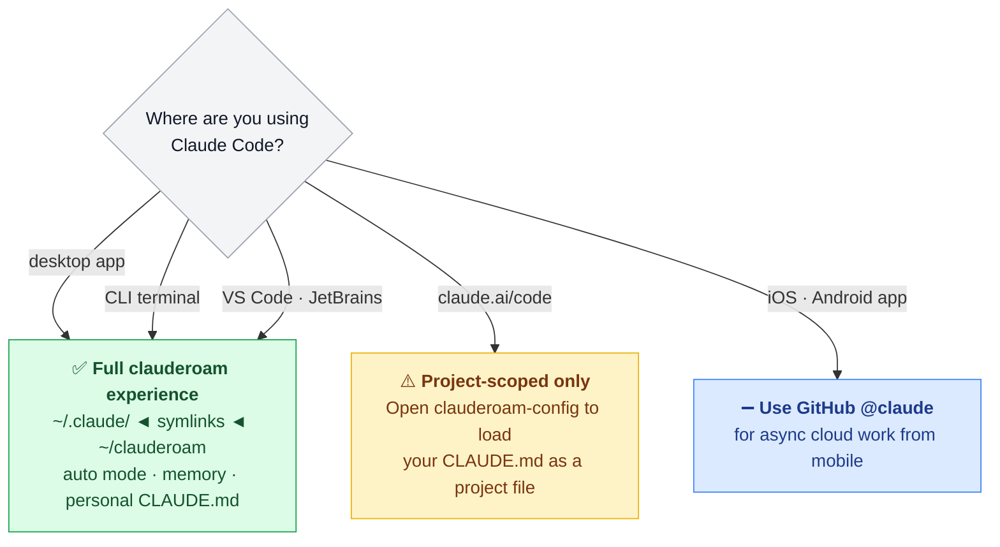
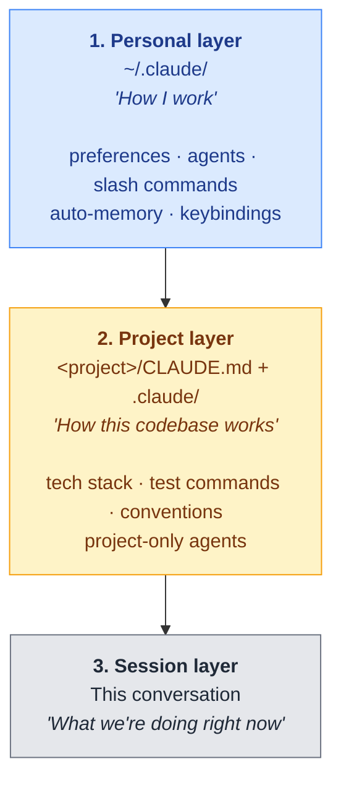
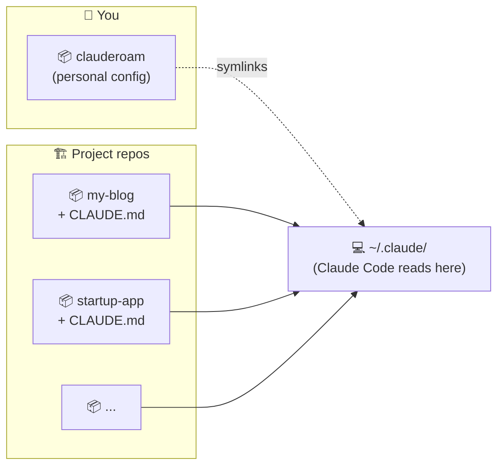
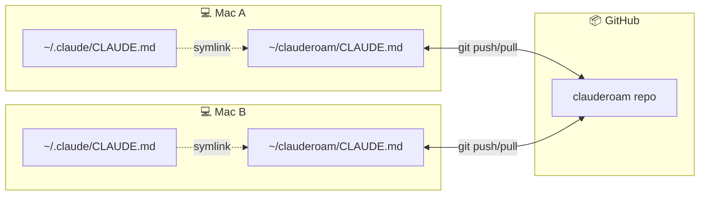
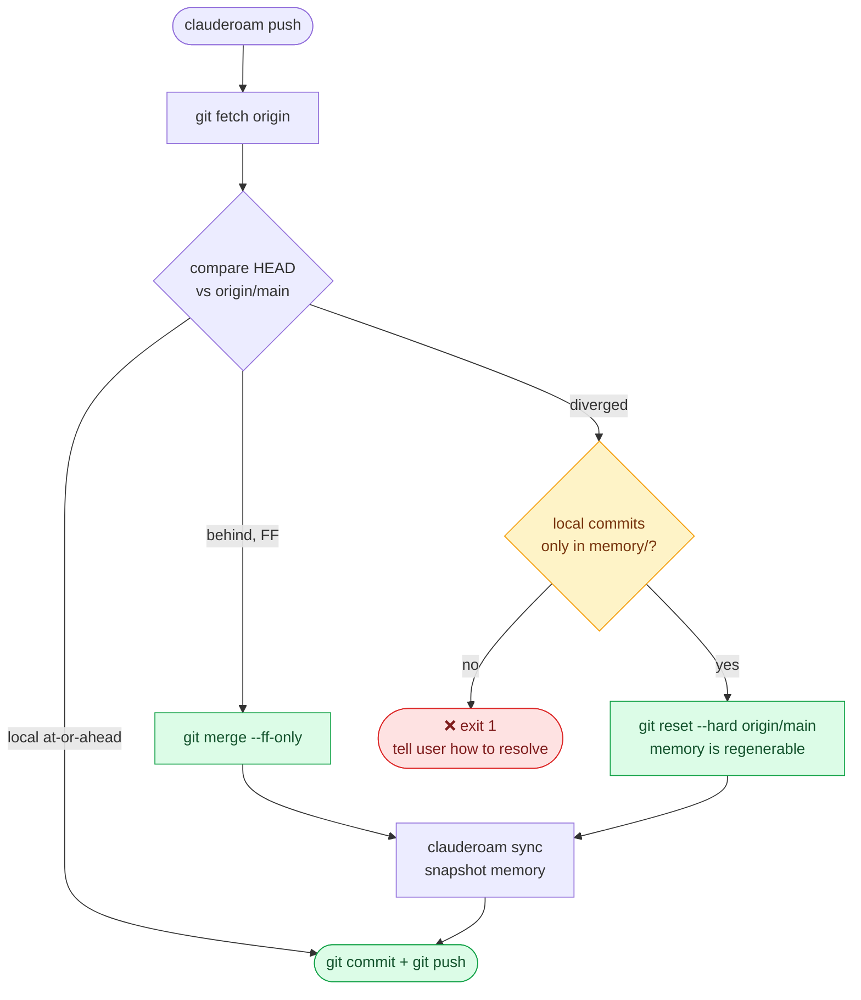

<div align="center">


<br/>

[](https://github.com/YunyueLi/clauderoam/actions/workflows/ci.yml)
[](LICENSE)
[](clauderoam)
[]()
[]()
[](https://github.com/YunyueLi/homebrew-tap)
[](CONTRIBUTING.md)

[中文](./README.zh-CN.md)  ·  [Docs](./docs)  ·  [Examples](./examples)  ·  [FAQ](./docs/faq.md)

<br/>


</div>

---

## Why this exists

I bought a new MacBook last month. Spent the morning excited to set it up. Then realized I'd spend the rest of the day reinstalling and reconfiguring Claude Code:

- the `CLAUDE.md` I'd tuned over weeks of feedback
- the seven custom subagents I'd written for code review, git ops, test running
- the slash commands that match how I think about commits and PRs
- the per-project auto-memory built up across half a dozen codebases

All of it was sitting in `~/.claude/` on the old machine. Nothing was in git. Nothing was on GitHub. Tied to one Mac, tied to one Claude account.

Two weeks later I had to switch to a client's Claude account for a contract. Same story. The customization I'd spent hours building was gone again.

**clauderoam** is what I built after the second time. Three commands on a new Mac:

```bash
brew install YunyueLi/tap/clauderoam
git clone <your-config-repo> ~/clauderoam
clauderoam install
```

Your `CLAUDE.md`, custom agents, slash commands, and snapshotted auto-memory are back. Switch accounts and they survive — only the credentials file changes, which is correct.

The whole thing is a git repo full of your portable Claude Code state, symlinked into `~/.claude/` where Claude Code reads it. No daemon, no service, no copy-and-paste — just dotfiles, specialized for Claude Code.

## Quick install

```bash
brew install YunyueLi/tap/clauderoam
clauderoam init
```

`init` creates your config repo at `~/clauderoam/`, personalizes your `CLAUDE.md`, and links it into `~/.claude/`. Same two commands on every other device — after pushing your repo to GitHub.

<details>
<summary>Don't have Homebrew? Use the curl installer or git clone.</summary>

```bash
# curl one-liner (verifies sha256)
curl -fsSL https://raw.githubusercontent.com/YunyueLi/clauderoam/main/install.sh | bash

# or git clone
git clone https://github.com/YunyueLi/clauderoam.git ~/clauderoam
cd ~/clauderoam && ./clauderoam init
```

</details>

---

## Where clauderoam works

clauderoam manages the **local Claude Code installation** — the one that reads `~/.claude/`. That covers the Mac desktop app, the CLI, and IDE extensions. The browser version of Claude Code is a different runtime and outside its scope.

| Surface | Status | Why |
|---|---|---|
| **Claude Code desktop** (macOS, Linux, Windows) | ✅ Full | Reads `~/.claude/`; clauderoam symlinks into it |
| **Claude Code CLI** (terminal) | ✅ Full | Same `~/.claude/` mechanism |
| **VS Code / JetBrains** extensions | ✅ Full | Same `~/.claude/` mechanism |
| **[claude.ai/code](https://claude.ai/code)** (web) | ⚠️ Project-only | Each web session is an isolated sandbox; no `~/.claude/` exists there. Workaround: open your `clauderoam-config` repo as the project so its `CLAUDE.md` loads — but `auto` mode and cross-project memory still aren't available |
| **Claude iOS / Android** app | ➖ N/A | Read-only chat. For mobile cloud work, use the [GitHub @claude bot](https://github.com/apps/claude) to delegate via issues/PRs |



### "Fully cloud" — two meanings

The phrase "cloud workflow" gets used for two different things. clauderoam solves one of them, not both:

| What you mean by "cloud" | clauderoam helps? |
|---|---|
| **My data and config live in GitHub**, not pinned to one Mac → I can switch Macs / Claude accounts and not lose anything | ✅ **Yes — this is exactly what clauderoam is for** |
| **I want to run Claude Code inside a browser** so I never install anything locally | ❌ No. That's claude.ai/code's job, and it has its own architectural limits (no user-level config, no `auto` mode, no cross-session memory). clauderoam can't change those |

If your goal is the first one — **use desktop Claude Code on each Mac you switch between, and let clauderoam carry your config in git**. That's the supported workflow.

---

## Mental model

Claude Code reads config from **three places** every time it starts. clauderoam manages the first one. Your projects own the second. The third is the live conversation.



> **Rule of thumb**<br/>
> If it follows _you_ across projects → **personal** (clauderoam).<br/>
> If it belongs to _this codebase_ → **project repo**.<br/>
> If it's just for _this conversation_ → nothing, it'll be in the transcript.

## What's in clauderoam vs what's in each project

|  | clauderoam (personal) | Each project repo |
|---|---|---|
| **Lives at** | `~/clauderoam/` → `~/.claude/` (symlinks) | `<project>/CLAUDE.md` + `<project>/.claude/` |
| **Who edits it** | You, alone | You and any contributors to that project |
| **Travels with** | Your Claude account & GitHub identity | The codebase |
| **Lifetime** | Years (your career) | Lifetime of the project |
| **Examples** | "Reply in 中文" · "use conventional commits" · your `/commit` slash command · the `code-reviewer` agent you use everywhere | "Python 3.12, `uv run pytest`" · "import sort: stdlib, third-party, local" · a `migration-checker` agent only useful here |



When you open `startup-app` in Claude Code, it loads **your personal layer + startup-app's project layer**, combined. Open `my-blog` next, same personal layer + my-blog's project layer. Two contexts, zero conflict.

## Project registry — pulling all your repos onto a new Mac

clauderoam doesn't sync project _code_ (each project is its own GitHub repo) but it does track **which projects you have** so a new machine can pull them in one command.

The list lives at `~/clauderoam/projects.tsv` — synced via git alongside your config.

```bash
clauderoam projects add        # register a project (interactive)
clauderoam projects list       # see the registry
clauderoam projects clone-all  # clone every registered project (skips existing)
clauderoam projects pull-all   # git pull each clean project
clauderoam projects status     # which projects are dirty / ahead / missing
clauderoam projects remove <name>
```

So the complete "set up a new Mac" flow becomes:

```bash
brew install YunyueLi/tap/clauderoam        # 1. install the CLI
git clone <your-clauderoam-repo> ~/clauderoam
clauderoam install                          # 2. personal config
clauderoam projects clone-all               # 3. all your projects
# 4. install per-project deps as needed (npm install / pip install / ...)
```

Four lines, full developer environment. The hero GIF at the top of this README shows the personal-config part of that flow. The projects part:

<p align="center">
  
</p>

## What clauderoam actually does (under the hood)

It does **not** copy or sync files. It uses **symlinks**.

```
~/.claude/CLAUDE.md ────► ~/clauderoam/CLAUDE.md
                          (the real file, tracked in git)
```

Editing one *is* editing the other. There's only one copy. No "did I forget to sync" anxiety.



**Switch accounts?** The symlink doesn't care which Claude account is signed in. Your config keeps working — only the credential file (`~/.claude/.credentials.json`) changes, which is exactly what you want.

The one exception is **auto-memory**, which is folder-tree based and gets snapshotted (real copy) by `clauderoam sync`. See [Memory](#memory) below.

### Multi-device push, with conflict handling

Two Macs both running `clauderoam push` on a schedule? Each produces a memory snapshot commit. They diverge. `clauderoam push` (v0.5.2+) reconciles automatically — the 4 cases it handles:



Memory snapshots are auto-regenerable from `~/.claude/projects/`, so last-writer-wins is the correct semantics for them. Edited `CLAUDE.md` or custom agents are not — losing those would be data loss, so push refuses to auto-resolve when those files diverge.

## Memory

Claude Code stores per-project memory at `~/.claude/projects/<encoded-path>/memory/`. Each project gets its own bucket:

```
~/.claude/projects/
├── -Users-you-Desktop-my-blog/
│   └── memory/
│       ├── MEMORY.md           ← index, always loaded
│       ├── user_xxx.md         ← facts about you
│       ├── feedback_xxx.md     ← corrections you've given
│       └── project_xxx.md      ← project state
│
├── -Users-you-Desktop-startup-app/
│   └── memory/  ← totally independent from my-blog's memory
│
└── -Users-you-Desktop-clauderoam/
    └── memory/
```

| Command | What it does |
|---|---|
| `clauderoam sync` | Copy every project's `memory/` into the clauderoam repo |
| `clauderoam restore` | Reverse: copy from repo back to `~/.claude/projects/`. Rewrites the username if the new machine has a different `$USER` |

## Install

### Prerequisites

On a fresh machine, set these up **before** running `clauderoam init`, otherwise the GitHub clone step will fail with `Permission denied (publickey)`.

| Need | Why | Get it |
|---|---|---|
| [Homebrew](https://brew.sh/) | installs the CLI | `/bin/bash -c "$(curl -fsSL https://raw.githubusercontent.com/Homebrew/install/HEAD/install.sh)"` |
| [`gh` CLI](https://cli.github.com/) | GitHub auth + SSH key upload | `brew install gh` |
| **GitHub SSH key** | cloning your private config and project repos | see below |
| Git identity | commit author info | `git config --global user.name "..."`<br/>`git config --global user.email "..."` |

#### GitHub SSH key — 3 commands

```bash
# 1. generate (no passphrase for convenience; add one if you prefer)
ssh-keygen -t ed25519 -C "you@example.com" -f ~/.ssh/id_ed25519 -N ""

# 2. upload to GitHub
gh auth login                                                # if not done
gh ssh-key add ~/.ssh/id_ed25519.pub --title "$(hostname)"

# 3. confirm
ssh -T git@github.com   # answer yes once, expect "Hi <username>!"
```

> **Gotcha**: when `gh auth login` asks _"Upload your SSH public key to your GitHub account?"_ the cursor sits on **Skip** by default. **Choose "Add an SSH key" instead** and it does steps 1+2 in one go. If you've already selected Skip, just run the manual steps above — same result.

### macOS / Linux (Homebrew)

```bash
brew install YunyueLi/tap/clauderoam
clauderoam init
```

Updates: `brew upgrade clauderoam` (updates the CLI only — your config repo is yours and is never touched).

### Without Homebrew (curl)

```bash
curl -fsSL https://raw.githubusercontent.com/YunyueLi/clauderoam/main/install.sh | bash
clauderoam init
```

Installs to `~/.local/bin/clauderoam` + `~/.local/share/clauderoam/`. Verifies sha256 against the release manifest. Override paths with `CLAUDEROAM_PREFIX`.

### From source (git clone)

```bash
git clone https://github.com/YunyueLi/clauderoam.git ~/clauderoam
cd ~/clauderoam
./clauderoam init
```

### On a second device

The CLI install is the same. To bring your config and all your project code:

```bash
brew install YunyueLi/tap/clauderoam        # or use install.sh / git clone
git clone <your-clauderoam-config-repo> ~/clauderoam
clauderoam install                          # personal config
clauderoam projects clone-all               # all your project repos
```

## Commands

| Command | What it does |
|---|---|
| `clauderoam init` | Interactive first-time setup — personalize and install |
| `clauderoam install` | Re-create the symlinks (idempotent, backs up first) |
| `clauderoam doctor` | Verify symlinks point right & no secrets are tracked |
| `clauderoam sync` | Snapshot `~/.claude/projects/*/memory/` into `./memory/` |
| `clauderoam restore` | Restore memory snapshots (handles username changes) |
| `clauderoam push` | `sync` + `git commit` + `git push` |
| `clauderoam status` | Show repo state and current symlinks |
| `clauderoam projects ...` | Manage your project registry — see [Project registry](#project-registry--pulling-all-your-repos-onto-a-new-mac) |
| `clauderoam --dry-run` | Preview any command without making changes |

## What gets synced

| ✅ Synced to git | ❌ Stays on the machine |
|---|---|
| `CLAUDE.md` · `settings.json` · `keybindings.json` | `.credentials.json` — your auth token |
| `agents/` · `skills/` · `commands/` | `sessions/` · `shell-snapshots/` · `telemetry/` |
| `memory/` (snapshots) | `policy-limits.json` · `projects/` runtime data |
| `projects.tsv` (project registry) | the project _code_ — that's each project's own git repo |

## Examples

Drop-in [agents](./examples/agents) and [slash commands](./examples/commands):

- 🤖 `code-reviewer` — focused diff review
- 🤖 `git-helper` — careful commit/branch/PR operations
- 🤖 `test-runner` — finds the right tests for a change
- 💬 `/commit` `/pr` `/sync` `/new-project` `/save`

Install one:

```bash
cp examples/agents/code-reviewer.md agents/
clauderoam push
```

## Documentation

- [Setup](./docs/setup.md) — install, uninstall, machine-local overrides, PATH
- [Multi-device workflow](./docs/multi-device.md) — adding Macs, iPhone, iPad
- [Switching Claude accounts](./docs/multi-account.md) — the migration checklist
- [Auto-sync](./docs/auto-sync.md) — optional hands-off shell hook
- [Releasing](./docs/RELEASING.md) — for maintainers: how to cut a release
- [Upstreaming to homebrew-core](./docs/HOMEBREW-CORE.md) — when/how to apply
- [FAQ](./docs/faq.md)

<details>
<summary><b>📊 How clauderoam compares to other Claude sync projects</b></summary>

<br/>

| Project | ⭐ | Sync backend | Auto-sync | Doctor | Memory snapshots | Multi-account focus | Bilingual | Stack |
|---|---|---|---|---|---|---|---|---|
| **clauderoam** | — | git | optional shell hook | ✓ | ✓ + username rewriting | **✓ designed for it** | ✓ EN / 中文 | pure bash |
| [renefichtmueller/claude-sync](https://github.com/renefichtmueller/claude-sync) | 16 | git · iCloud · Dropbox · Syncthing · rsync | ✓ | implicit | manual | ✗ | ✗ | TypeScript |
| [balingsisi/claude-sync-tool](https://github.com/balingsisi/claude-sync-tool) | 11 | git | watch mode | ✓ | ✗ | ✗ | ✗ | CLI |
| [elizabethfuentes12/claude-code-dotfiles](https://github.com/elizabethfuentes12/claude-code-dotfiles) | 9 | git | ✓ shell function | ✗ | ✗ | ✗ | ✗ | shell |
| [zircote/.claude](https://github.com/zircote/.claude) | 24 | git (fork model) | ✗ | ✗ | ✗ | ✗ | ✗ | dotfiles + 100+ agents |

**Pick clauderoam** if you switch Claude accounts, want bilingual docs, prefer zero dependencies, or want memory snapshots that survive a username change.

**Pick renefichtmueller/claude-sync** if you want multiple sync backends (iCloud, Dropbox, Syncthing).

**Pick zircote/.claude** if you mostly want a curated agent library.

</details>

<details>
<summary><b>❓ FAQ</b></summary>

<br/>

**Will this break Claude Code?**<br/>
No. Symlinks are transparent — Claude Code reads `~/.claude/` exactly as before.

**Should the clauderoam repo be public or private?**<br/>
Private if you sync `memory/` (it may contain project notes). Otherwise public is fine and lets you show off your setup.

**Does `init` / `install` delete anything?**<br/>
No. It copies your current `~/.claude/` to `~/.claude.bak.<timestamp>` first. Run `--dry-run` to preview.

**Is this a portable Claude Code _binary_?**<br/>
No — it's portable **config**. For USB-drive Claude Code, see [`SonnyTaylor/claude-code-portable`](https://github.com/SonnyTaylor/claude-code-portable).

**Linux? WSL?**<br/>
Should work. Pure bash, only standard Unix tools.

**Can I have machine-only overrides that don't sync?**<br/>
Yes: `~/.claude/settings.local.json` and `~/.claude/CLAUDE.local.md` are gitignored and loaded in addition to the shared versions.

**How do project `CLAUDE.md` files interact with my personal one?**<br/>
They _combine_. Personal sets defaults; project overrides where they conflict. See [Mental model](#mental-model) above.

**How do I undo everything?**<br/>
Remove the symlinks in `~/.claude/` and restore from `~/.claude.bak.<timestamp>`. See [docs/setup.md#uninstall](./docs/setup.md).

</details>

## Contributing

Issues and PRs welcome — see [CONTRIBUTING.md](./CONTRIBUTING.md). Keep it small, keep it bash, keep it readable.

## License

[MIT](./LICENSE) © YunyueLi and contributors
