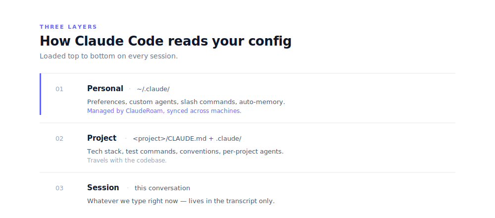
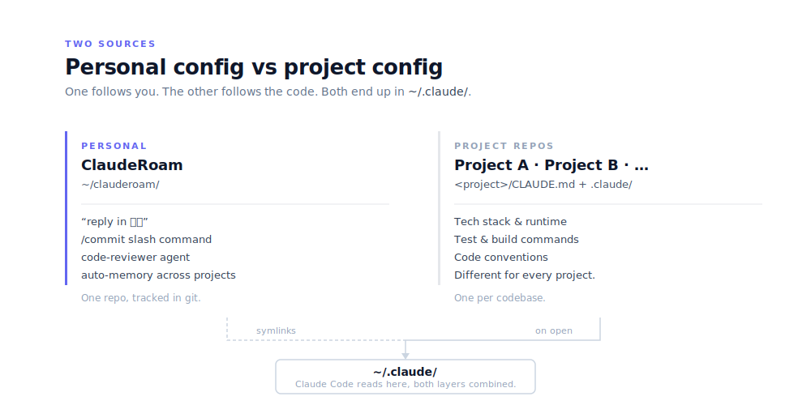
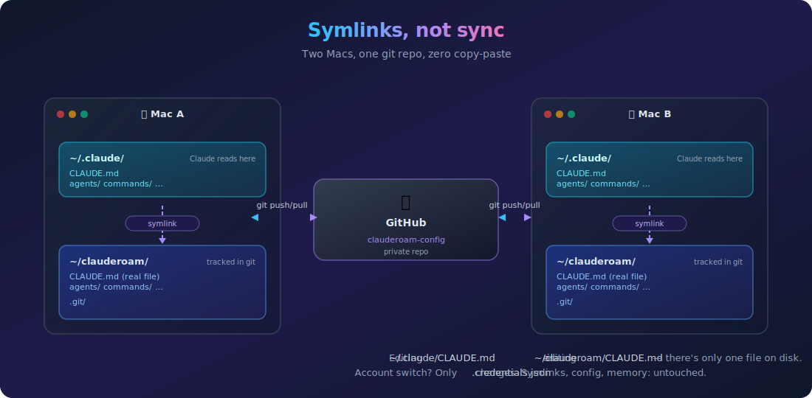
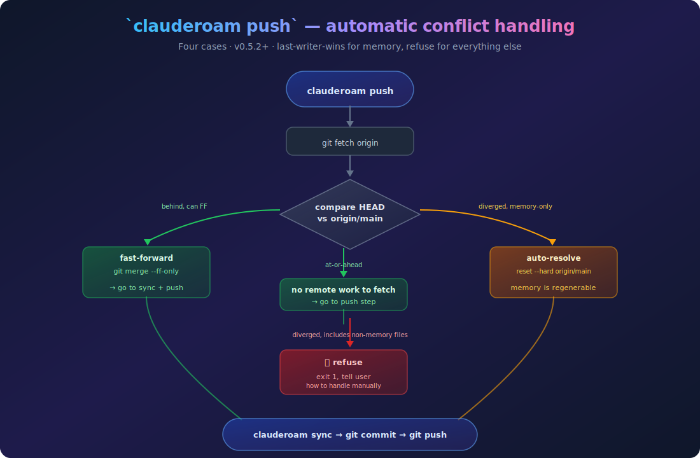

<div align="center">


<br/>

[](https://github.com/YunyueLi/ClaudeRoam/actions/workflows/ci.yml)
[](LICENSE)
[]()
[]()
[]()
[](https://github.com/YunyueLi/homebrew-tap)
[](CONTRIBUTING.md)

[中文](./README.zh-CN.md)  ·  [Docs](./docs)  ·  [Examples](./examples)  ·  [FAQ](./docs/faq.md)

<br/>


</div>

---

## Why this exists

I bought a new MacBook last month. Spent the morning excited to set it up. Then realized I'd spend the rest of the day reinstalling and reconfiguring Claude Code:

- the `CLAUDE.md` I'd tuned over weeks of feedback
- the seven custom subagents I'd written for code review, git ops, test running
- the slash commands that match how I think about commits and PRs
- the per-project auto-memory built up across half a dozen codebases

All of it was sitting in `~/.claude/` on the old machine. Nothing was in git. Nothing was on GitHub. Tied to one Mac, tied to one Claude account.

Two weeks later I had to switch to a client's Claude account for a contract. Same story. Hours of customization, gone again.

**ClaudeRoam** is what I built after the second time. It's a git repo of your portable Claude Code state, symlinked back into `~/.claude/` where Claude Code reads it. No daemon, no service, no copy-paste — just dotfiles, specialized for Claude Code.

## What this gives you

Five kinds of Claude Code customization that today only live on one Mac:

| Thing | Example |
|---|---|
| **Your preferences** | "reply in 中文", "no trailing summary", "use conventional commits" |
| **Custom subagents** | your `code-reviewer`, `git-helper`, `test-runner` |
| **Slash commands** | `/commit`, `/pr`, `/save` |
| **Project registry** | which GitHub repos you want present on every Mac |
| **Auto-memory** | what Claude has learned about you across sessions |

ClaudeRoam makes them follow **you**, not the machine. Four concrete wins:

| Scenario | What you do | Result |
|---|---|---|
| **Restore on a new Mac** | 4 commands ([see Install](#install)) | Claude Code recognizes you, uses your style, has your custom agents, project code checked out. ~5 minutes total. |
| **Switch Claude accounts** | sign out / sign in | Only `.credentials.json` changes (correct). Your config, agents, commands, memory: untouched. |
| **Drive work from your phone** | open issue: `@claude fix typo in README §3` | Claude runs in the cloud via the [GitHub @claude bot](https://github.com/apps/claude), opens a PR. iPhone never holds any state. |
| **Multiple Macs in parallel** | LaunchAgent on each Mac pushes every 30 min | v0.5.2+ auto-resolves memory-only divergence. You never see a "manual fix required" error. |

---

## Install

### Prerequisites (do this first on every new Mac)

Without these, the GitHub clone step will fail with `Permission denied (publickey)`.

| Need | How |
|---|---|
| [Homebrew](https://brew.sh/) | `/bin/bash -c "$(curl -fsSL https://raw.githubusercontent.com/Homebrew/install/HEAD/install.sh)"` |
| [`gh`](https://cli.github.com/) CLI | `brew install gh` |
| GitHub SSH key | `gh auth login` and **choose "Add an SSH key"** when prompted (the cursor defaults to **Skip** — don't take it) |
| Git identity | `git config --global user.name "..."` and `user.email "..."` |

If you accidentally chose Skip on the SSH step, recover with:

```bash
ssh-keygen -t ed25519 -C "you@example.com" -f ~/.ssh/id_ed25519 -N ""
gh ssh-key add ~/.ssh/id_ed25519.pub --title "$(hostname)"
ssh -T git@github.com   # answer yes, expect "Hi <username>!"
```

### First Mac (creating your config repo)

```bash
brew install YunyueLi/tap/clauderoam
clauderoam init
```

`init` creates `~/clauderoam/`, personalizes `CLAUDE.md`, and symlinks into `~/.claude/`. Then push the new repo to your GitHub.

### Every other Mac (using your existing config repo)

```bash
brew install YunyueLi/tap/clauderoam
git clone git@github.com:<you>/clauderoam-config.git ~/clauderoam
clauderoam install
clauderoam projects clone-all   # also pulls every registered project repo
```

<details>
<summary>Don't have Homebrew? Use curl or git clone.</summary>

```bash
# curl one-liner (verifies sha256)
curl -fsSL https://raw.githubusercontent.com/YunyueLi/ClaudeRoam/main/install.sh | bash

# or git clone the CLI source
git clone https://github.com/YunyueLi/ClaudeRoam.git ~/ClaudeRoam-src
cd ~/ClaudeRoam-src && ./clauderoam init
```

</details>

## Daily use

**Most of the time: nothing.** A LaunchAgent runs `clauderoam push` every 30 minutes in the background (see [docs/auto-sync.md](./docs/auto-sync.md) for the one-command install). Your customization gets snapshotted to GitHub automatically.

When you do need to touch it:

| You want to… | Do this |
|---|---|
| Add a custom slash command or agent | Tell Claude Code: _"create a `/refactor` slash command that…"_. Claude writes the file into `~/.claude/commands/` and runs `clauderoam push` |
| Tweak your preferences | Edit `~/.claude/CLAUDE.md` (or ask Claude to), then `clauderoam push` |
| Check the sync state | `clauderoam status` |
| Health check | `clauderoam doctor` |
| Upgrade ClaudeRoam itself | `brew upgrade clauderoam` |

---

## How it works

### Three layers Claude Code reads from

Every time Claude Code starts, it loads config from three places. ClaudeRoam manages the first.

<p align="center">
  
</p>

> **Rule of thumb**
> - Follows _you_ across projects → **personal** (ClaudeRoam)
> - Belongs to _this codebase_ → **project repo**
> - Only for _this conversation_ → nothing, lives in the transcript

### Personal config vs project config

|  | ClaudeRoam (personal) | Each project repo |
|---|---|---|
| **Lives at** | `~/clauderoam/` → `~/.claude/` (symlinks) | `<project>/CLAUDE.md` + `<project>/.claude/` |
| **Who edits it** | You, alone | You and any contributors to that project |
| **Travels with** | Your identity (across Macs and accounts) | The codebase |
| **Examples** | "Reply in 中文" · `code-reviewer` agent · `/commit` slash command | "Python 3.12 + pytest" · project build commands · `migration-checker` agent |

<p align="center">
  
</p>

Open Project A in Claude Code → it loads your personal layer + Project A's project layer, combined. Open Project B next → same personal layer + Project B's project layer. Two contexts, zero conflict.

### Symlinks, not sync

ClaudeRoam doesn't copy files. It uses symlinks.

```
~/.claude/CLAUDE.md ────► ~/clauderoam/CLAUDE.md
                          (the real file, tracked in git)
```

Editing one *is* editing the other. There's only one copy on disk. No "did I forget to sync" question.

<p align="center">
  
</p>

Switching Claude accounts doesn't disturb any of this. Your symlinks don't depend on which account is signed in — `.credentials.json` changes (which is correct), nothing else.

The one exception is **auto-memory**: it's a folder tree (not a single file), so it gets snapshotted by `clauderoam sync` rather than symlinked. See [Memory](#memory).

## Multi-device push, with automatic conflict handling

Two Macs both running `clauderoam push` on a schedule? Each produces a memory snapshot commit. They diverge. `clauderoam push` (v0.5.2+) reconciles automatically — the 4 cases it handles:

<p align="center">
  
</p>

Memory snapshots are auto-regenerable from `~/.claude/projects/`, so last-writer-wins is correct for them. Edited `CLAUDE.md` or custom agents are not — losing those would be real data loss, so push refuses to auto-resolve when those files diverge.

## Memory

Claude Code stores per-project memory at `~/.claude/projects/<encoded-path>/memory/` — separate buckets per codebase. Two commands move them through git:

| Command | What it does |
|---|---|
| `clauderoam sync` | Snapshot every project's `memory/` into the clauderoam repo |
| `clauderoam restore` | Reverse direction. Rewrites the username portion of paths if the new machine has a different `$USER` |

The username rewriting matters: on Mac A your projects live at `/Users/you-a/Desktop/...`; on Mac B they live at `/Users/you-b/Desktop/...`. Restoring memory from A to B without the rewrite would leave the paths pointing nowhere.

## Project registry

ClaudeRoam doesn't sync project _code_ (each project is its own GitHub repo) but it does track **which projects you have**, so a new machine can pull them in one command.

The list lives at `~/clauderoam/projects.tsv` — synced via git alongside your config.

```bash
clauderoam projects add        # register a project (interactive)
clauderoam projects list       # see the registry
clauderoam projects clone-all  # clone every registered project (skips existing)
clauderoam projects pull-all   # git pull each clean project
clauderoam projects status     # which projects are dirty / ahead / missing
clauderoam projects remove <name>
```

<p align="center">
  
</p>

## Where it works

| Surface | Status | Note |
|---|---|---|
| **Claude Code desktop** (macOS / Linux / Windows) | ✅ Full | Reads `~/.claude/`; ClaudeRoam symlinks into it |
| **Claude Code CLI** (terminal) | ✅ Full | Same `~/.claude/` mechanism |
| **VS Code / JetBrains** extensions | ✅ Full | Same `~/.claude/` mechanism |
| **[claude.ai/code](https://claude.ai/code)** (web) | ⚠️ Project-only | Each web session is an isolated sandbox; no persistent `~/.claude/`. Workaround: open your `clauderoam-config` repo as the project so its `CLAUDE.md` loads — but `auto` mode and cross-project memory still aren't available |
| **Claude iOS / Android** app | ➖ N/A | Chat client. Use the [GitHub @claude bot](https://github.com/apps/claude) for mobile cloud work |

> "Cloud workflow" can mean two different things. See the [FAQ](#-faq) for which one ClaudeRoam solves.

---

## Reference

### Commands

| Command | What it does |
|---|---|
| `clauderoam init` | Interactive first-time setup — personalize and install |
| `clauderoam install` | (Re-)create the symlinks (idempotent, backs up first) |
| `clauderoam doctor` | Verify symlinks point right & no secrets are tracked |
| `clauderoam sync` | Snapshot `~/.claude/projects/*/memory/` into `./memory/` |
| `clauderoam restore` | Restore memory snapshots (handles username changes) |
| `clauderoam push` | `sync` + `git commit` + `git push` (with conflict auto-resolve) |
| `clauderoam status` | Show repo state and current symlinks |
| `clauderoam projects ...` | Manage your project registry — see [Project registry](#project-registry) |
| `clauderoam --dry-run` | Preview any command without changing anything |

### What gets synced

| ✅ Synced to git | ❌ Stays on the machine |
|---|---|
| `CLAUDE.md` · `settings.json` · `keybindings.json` | `.credentials.json` — your auth token |
| `agents/` · `skills/` · `commands/` | `sessions/` · `shell-snapshots/` · `telemetry/` |
| `memory/` (snapshots) | `policy-limits.json` · `projects/` runtime data |
| `projects.tsv` (project registry) | the project _code_ itself — that's each project's own git repo |

### Examples

Drop-in [agents](./examples/agents) and [slash commands](./examples/commands):

- 🤖 `code-reviewer` — focused diff review
- 🤖 `git-helper` — careful commit/branch/PR operations
- 🤖 `test-runner` — finds the right tests for a change
- 💬 `/commit` `/pr` `/sync` `/new-project` `/save`

Install one:

```bash
cp examples/agents/code-reviewer.md agents/
clauderoam push
```

## Troubleshooting

| Symptom | Meaning | Fix |
|---|---|---|
| Claude Code doesn't recognize you / your preferences seem missing | The `~/.claude/` symlinks got broken or removed | `clauderoam install` |
| `clauderoam push` fails with `Permission denied (publickey)` | This Mac has no SSH key on file with GitHub | See [Prerequisites](#prerequisites-do-this-first-on-every-new-mac) |
| `clauderoam push` fails with `[rejected] (fetch first)` | Local commits diverged with non-memory changes (v0.5.2 auto-resolves memory-only divergences) | `cd ~/clauderoam && git status` and resolve manually |
| GIFs not playing right after a push | GitHub's CDN cache (≤5 min) | Wait or hard-refresh |
| Not sure what state things are in | | `clauderoam doctor` — full colored health check |

---

## Documentation

- [Setup](./docs/setup.md) — install, uninstall, machine-local overrides
- [Multi-device workflow](./docs/multi-device.md) — adding Macs, iPhone, iPad
- [Switching Claude accounts](./docs/multi-account.md) — migration checklist
- [Auto-sync](./docs/auto-sync.md) — optional hands-off shell hook / LaunchAgent
- [Releasing](./docs/RELEASING.md) — for maintainers
- [Upstreaming to homebrew-core](./docs/HOMEBREW-CORE.md) — when/how
- [FAQ](./docs/faq.md)

<details>
<summary><b>📊 Comparison vs other Claude sync projects</b></summary>

<br/>

| Project | ⭐ | Sync backend | Auto-sync | Doctor | Memory snapshots | Multi-account focus | Bilingual | Stack |
|---|---|---|---|---|---|---|---|---|
| **ClaudeRoam** | — | git | optional shell hook | ✓ | ✓ + username rewriting | **✓ designed for it** | ✓ EN / 中文 | pure bash |
| [renefichtmueller/claude-sync](https://github.com/renefichtmueller/claude-sync) | 16 | git · iCloud · Dropbox · Syncthing · rsync | ✓ | implicit | manual | ✗ | ✗ | TypeScript |
| [balingsisi/claude-sync-tool](https://github.com/balingsisi/claude-sync-tool) | 11 | git | watch mode | ✓ | ✗ | ✗ | ✗ | CLI |
| [elizabethfuentes12/claude-code-dotfiles](https://github.com/elizabethfuentes12/claude-code-dotfiles) | 9 | git | ✓ shell function | ✗ | ✗ | ✗ | ✗ | shell |
| [zircote/.claude](https://github.com/zircote/.claude) | 24 | git (fork model) | ✗ | ✗ | ✗ | ✗ | ✗ | dotfiles + 100+ agents |

**Pick ClaudeRoam** if you switch Claude accounts, want bilingual docs, prefer zero dependencies, or want memory snapshots that survive a username change.

**Pick renefichtmueller/claude-sync** if you want multiple sync backends (iCloud, Dropbox, Syncthing).

**Pick zircote/.claude** if you mostly want a curated agent library.

</details>

<details>
<summary><b>❓ FAQ</b></summary>

<br/>

**Will this break Claude Code?**<br/>
No. Symlinks are transparent — Claude Code reads `~/.claude/` exactly as before.

**Should your ClaudeRoam config repo be public or private?**<br/>
Private if you sync `memory/` (it can contain project notes). Otherwise public is fine and lets you show off your setup.

**Does `init` / `install` delete anything?**<br/>
No. Your existing `~/.claude/` is copied to `~/.claude.bak.<timestamp>` first. Run `--dry-run` to preview.

**Is this a portable Claude Code _binary_?**<br/>
No — it's portable **config**. For USB-drive Claude Code see [`SonnyTaylor/claude-code-portable`](https://github.com/SonnyTaylor/claude-code-portable).

**Linux? WSL?**<br/>
Should work. Pure bash, only standard Unix tools.

**Can I have machine-only overrides that don't sync?**<br/>
Yes: `~/.claude/settings.local.json` and `~/.claude/CLAUDE.local.md` are gitignored and loaded in addition to the shared versions.

**How do project `CLAUDE.md` files interact with my personal one?**<br/>
They _combine_. Personal sets defaults; project overrides where they conflict.

<a name="cloud"></a>**"Cloud workflow" — does that mean I should switch to claude.ai/code?**<br/>
"Cloud" can mean two things: (1) data and config live in GitHub instead of one Mac (← ClaudeRoam solves this), or (2) Claude Code runs in a browser, no local install (← that's claude.ai/code, with limits ClaudeRoam can't change: no `auto` mode, no user-level config, no persistent memory). For "follow me everywhere", you want (1) with desktop Claude Code on each Mac. For mobile or "someone else's computer", use the [@claude GitHub bot](https://github.com/apps/claude).

**How do I undo everything?**<br/>
Remove the symlinks in `~/.claude/` and restore from `~/.claude.bak.<timestamp>`. See [docs/setup.md](./docs/setup.md).

</details>

## Contributing

Issues and PRs welcome — see [CONTRIBUTING.md](./CONTRIBUTING.md). Keep it small, keep it bash, keep it readable.

## License

[MIT](./LICENSE) © YunyueLi and contributors
