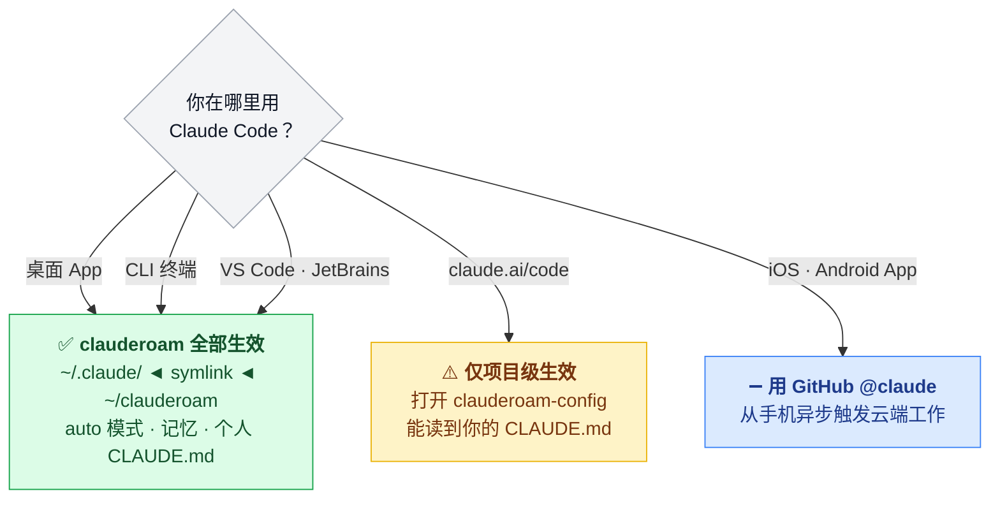
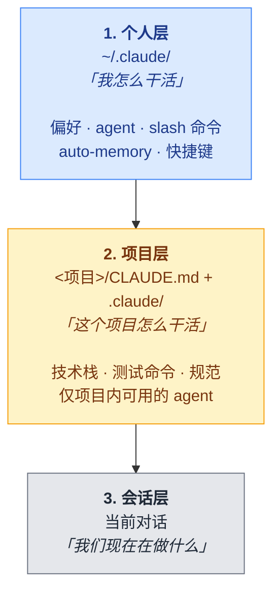
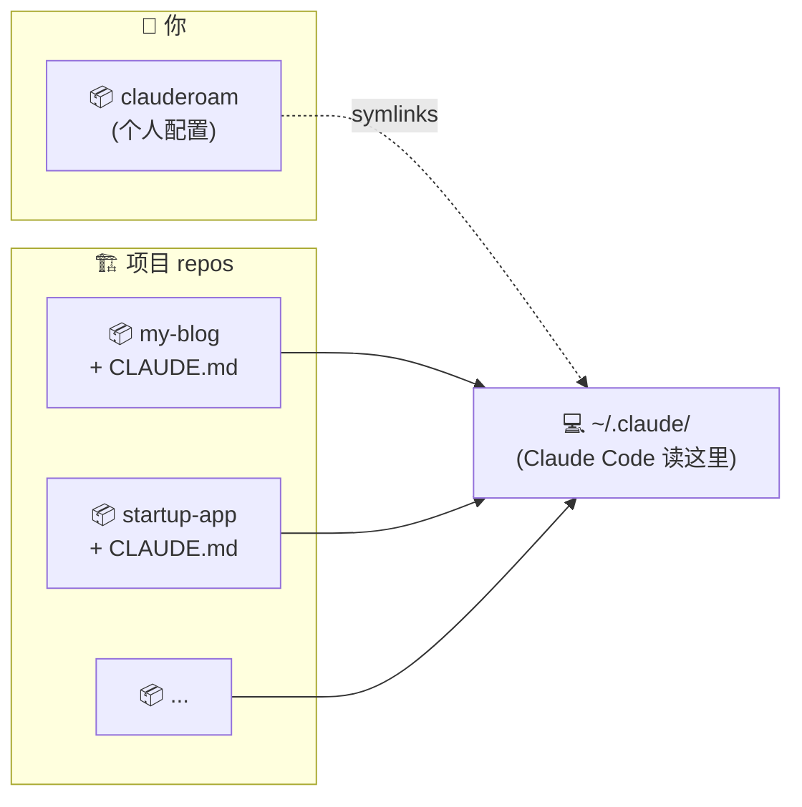
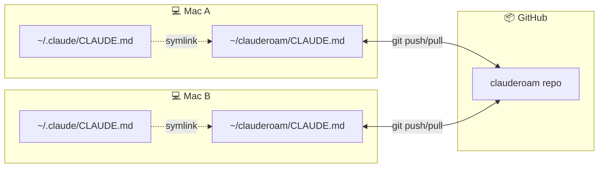
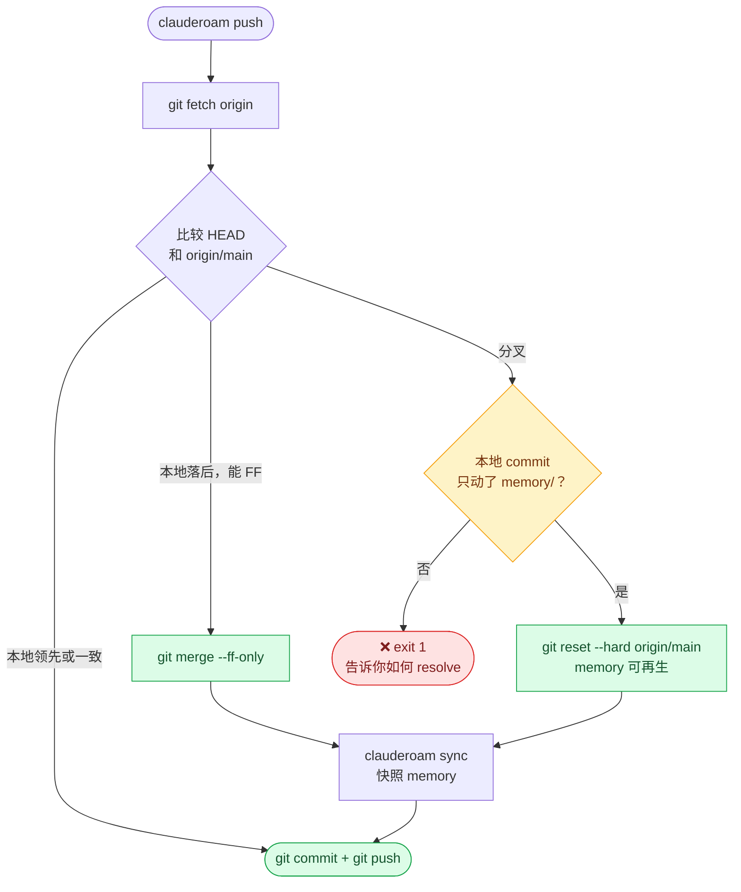

<div align="center">


<br/>

[](https://github.com/YunyueLi/clauderoam/actions/workflows/ci.yml)
[](LICENSE)
[](clauderoam)
[]()
[]()
[](https://github.com/YunyueLi/homebrew-tap)
[](CONTRIBUTING.md)

[English](./README.md)  ·  [文档](./docs)  ·  [示例](./examples)  ·  [FAQ](./docs/faq.md)

<br/>


</div>

---

## 为什么有这个东西

上个月买了台新 MacBook，本来兴致勃勃要折腾，结果发现整个上午要花在重装重配 Claude Code 上：

- 几周里反复调教出来的 `CLAUDE.md`
- 自己写的 7 个 subagent（code review、git 操作、跑测试……）
- 跟我思维方式匹配的 commit / PR slash 命令
- 在十来个项目里积累出来的 auto-memory

这些东西全在老 Mac 的 `~/.claude/` 里 —— 不在 git，不在 GitHub，绑死在那台机器、那个 Claude 账号上。

两周后又因为接外包要切到客户的 Claude 账号 —— 同样的故事，几小时调出来的东西又一次清零。

**clauderoam** 就是第二次清零之后写出来的。新 Mac 上 3 条命令：

```bash
brew install YunyueLi/tap/clauderoam
git clone <你的 config repo> ~/clauderoam
clauderoam install
```

`CLAUDE.md`、自定义 agent、slash 命令、auto-memory 快照 —— 全回来了。换账号也不丢，**只有 credentials 文件被替换**（这正是你要的）。

核心机制就是：你那个装着可移植 Claude Code 状态的 git repo，被 symlink 到 `~/.claude/`，Claude Code 照常读取。没有 daemon、没有后台服务、不用复制粘贴 —— 就是 dotfiles，只不过专门为 Claude Code 做了优化。

## 快速安装

```bash
brew install YunyueLi/tap/clauderoam
clauderoam init
```

`init` 会在 `~/clauderoam/` 创建你的配置 repo、个性化 `CLAUDE.md`、symlink 到 `~/.claude/`。每台新设备同样两条命令（前提是你已经把 repo push 到 GitHub）。

<details>
<summary>没装 Homebrew？用 curl 或 git clone。</summary>

```bash
# curl 一键安装（带 sha256 校验）
curl -fsSL https://raw.githubusercontent.com/YunyueLi/clauderoam/main/install.sh | bash

# 或 git clone
git clone https://github.com/YunyueLi/clauderoam.git ~/clauderoam
cd ~/clauderoam && ./clauderoam init
```

</details>

---

## clauderoam 在哪些场景生效

clauderoam 管的是**本地 Claude Code 安装** —— 也就是会读 `~/.claude/` 的那些。包括 Mac 桌面 App、CLI、IDE 扩展。**浏览器版（claude.ai/code）是另一个运行时**，不在它的覆盖范围里。

| 入口 | 状态 | 原因 |
|---|---|---|
| **Claude Code 桌面 App**（macOS / Linux / Windows） | ✅ 全部生效 | 读 `~/.claude/`，clauderoam symlink 到里面 |
| **Claude Code CLI**（终端） | ✅ 全部生效 | 同一套 `~/.claude/` 机制 |
| **VS Code / JetBrains** 扩展 | ✅ 全部生效 | 同一套 `~/.claude/` 机制 |
| **[claude.ai/code](https://claude.ai/code)**（网页版） | ⚠️ 仅项目级 | 每个网页 session 都是独立沙箱，根本没有 `~/.claude/`。**绕过办法**：把 `clauderoam-config` repo 当项目打开，它的 `CLAUDE.md` 会被加载 —— 但 `auto` 模式、跨项目记忆、跨 session 记忆都还是没有 |
| **Claude iOS / Android** App | ➖ 不适用 | 只读聊天客户端。移动端的云端工作请用 [GitHub @claude bot](https://github.com/apps/claude) 通过 issue/PR 异步触发 |



### "全程云端" 有两种含义

"云端工作流" 这个词被两种意思混着用。**clauderoam 只解决其中一种**：

| 你说"云端"指的是 | clauderoam 管这个吗 |
|---|---|
| **我的数据和配置存在 GitHub**，不绑死在某一台 Mac 上 → 换 Mac、换 Claude 账号都不丢 | ✅ **就是干这个的** |
| **我想在浏览器里跑 Claude Code**，本地完全不装东西 | ❌ 那是 claude.ai/code 的活，它本身有架构限制（没有用户级配置、没有 `auto` 模式、没有跨 session 记忆）。clauderoam 改不了这些 |

如果你想要的是第一种 —— **在你切换的每台 Mac 上都装 Claude Code 桌面版，让 clauderoam 帮你把配置用 git 带过去**。这是支持的工作流。

---

## 心智模型

Claude Code 每次启动都从**三个地方**读配置。clauderoam 管第一层，你的项目管第二层，第三层是当前对话。



> **判断准则**<br/>
> 跟着_你_跨项目走的 → **个人层**（clauderoam）<br/>
> 属于_这个代码库_的 → **项目 repo**<br/>
> 仅这次对话的 → 什么都不用做，对话记录里有

## clauderoam 装什么 vs 项目 repo 装什么

|  | clauderoam（个人） | 每个项目的 repo |
|---|---|---|
| **存在哪** | `~/clauderoam/` → `~/.claude/`（symlink） | `<项目>/CLAUDE.md` + `<项目>/.claude/` |
| **谁来编辑** | 你一个人 | 你和这个项目的所有贡献者 |
| **跟谁走** | 你的 Claude 账号和 GitHub 身份 | 代码库 |
| **生命周期** | 多年（你的职业生涯） | 项目的生命周期 |
| **举例** | "用中文回复" · "用 conventional commits" · 你的 `/commit` 命令 · 处处通用的 `code-reviewer` agent | "Python 3.12, `uv run pytest`" · "import 顺序：标准库、第三方、本地" · 只在这里有用的 `migration-checker` agent |



在 `startup-app` 里打开 Claude Code 时，它加载**你的个人层 + startup-app 项目层**，组合使用。切换到 `my-blog`，同样的个人层 + my-blog 的项目层。两个上下文，零冲突。

## 项目清单 —— 新 Mac 一键拉所有 repo

clauderoam 不同步项目_代码_（每个项目自己是一个 GitHub repo），但它会跟踪**你有哪些项目**，让新机器能一条命令把它们拉回来。

清单存在 `~/clauderoam/projects.tsv` —— 和其他个人配置一起走 git。

```bash
clauderoam projects add        # 注册一个项目（交互式）
clauderoam projects list       # 看清单
clauderoam projects clone-all  # 把每个已注册项目都 clone 过来（已存在的跳过）
clauderoam projects pull-all   # 给每个干净的项目 git pull
clauderoam projects status     # 哪些项目脏 / 领先 / 没拉
clauderoam projects remove <name>
```

所以"新 Mac 设置"的完整流程是：

```bash
brew install YunyueLi/tap/clauderoam        # 1. 装 CLI
git clone <你的 clauderoam repo> ~/clauderoam
clauderoam install                          # 2. 个人配置
clauderoam projects clone-all               # 3. 所有项目代码
# 4. 各项目按需装依赖（npm install / pip install / ...）
```

四行命令，完整开发环境。README 顶部的 hero GIF 演了前 3 步里的"个人配置回来了"，下面这个补完了"项目代码也回来了"那部分：

<p align="center">
  
</p>

## clauderoam 内部到底在做什么

它**不** copy、也**不** sync 文件。它用的是 **symlink**。

```
~/.claude/CLAUDE.md ────► ~/clauderoam/CLAUDE.md
                          （真文件，git 跟踪的版本）
```

改一个就是改另一个 —— 只有一份。没有"我忘了同步吗"的焦虑。



**换账号？** Symlink 不在乎你登的是哪个 Claude 账号。配置照常工作 —— 只有凭证文件（`~/.claude/.credentials.json`）会被替换，**这正是你想要的行为**。

唯一的例外是 **auto-memory** —— 因为是文件树结构，由 `clauderoam sync` 做真正的拷贝快照。见下方 [Memory](#memory) 部分。

### 多设备 push，自带冲突处理

两台 Mac 都定时跑 `clauderoam push`？两边都会产生 memory 快照 commit，必然分叉。`clauderoam push`（v0.5.2+）会自动 reconcile，它处理的 4 种情况：



memory 快照来自 `~/.claude/projects/`，每次 sync 重新生成 —— last-writer-wins 是它的正确语义。但手动改的 `CLAUDE.md` 或自定义 agent 不一样，丢了就是丢了 —— 所以 push 在这两种文件分叉时拒绝自动处理。

## Memory

Claude Code 把项目级 memory 存在 `~/.claude/projects/<编码路径>/memory/`，每个项目独立：

```
~/.claude/projects/
├── -Users-you-Desktop-my-blog/
│   └── memory/
│       ├── MEMORY.md           ← 索引，始终加载
│       ├── user_xxx.md         ← 关于你的事实
│       ├── feedback_xxx.md     ← 你给过的纠正
│       └── project_xxx.md      ← 项目状态
│
├── -Users-you-Desktop-startup-app/
│   └── memory/  ← 跟 my-blog 的 memory 完全独立
│
└── -Users-you-Desktop-clauderoam/
    └── memory/
```

| 命令 | 作用 |
|---|---|
| `clauderoam sync` | 把每个项目的 `memory/` 拷贝进 clauderoam 仓库 |
| `clauderoam restore` | 反向：从仓库拷贝回 `~/.claude/projects/`。在新机器上自动重写用户名 |

## 安装

### 先决条件（新机器必看）

在新 Mac 上跑 `clauderoam init` **之前**先把这几样配好，不然 git clone 私有 repo 那步会报 `Permission denied (publickey)`。

| 需要 | 干什么的 | 怎么装 |
|---|---|---|
| [Homebrew](https://brew.sh/) | 装 CLI 用 | `/bin/bash -c "$(curl -fsSL https://raw.githubusercontent.com/Homebrew/install/HEAD/install.sh)"` |
| [`gh` CLI](https://cli.github.com/) | GitHub 登录 + 上传 SSH key | `brew install gh` |
| **GitHub SSH key** | clone 你的私有 config / 项目 repo | 见下面 3 行命令 |
| Git 身份 | commit 时记作者 | `git config --global user.name "..."`<br/>`git config --global user.email "..."` |

#### GitHub SSH key —— 3 条命令搞定

```bash
# 1. 生成（图方便不设密码；要安全就去掉 -N ""）
ssh-keygen -t ed25519 -C "you@example.com" -f ~/.ssh/id_ed25519 -N ""

# 2. 上传到 GitHub
gh auth login                                                # 还没登过的话
gh ssh-key add ~/.ssh/id_ed25519.pub --title "$(hostname)"

# 3. 验证
ssh -T git@github.com   # 第一次问 yes/no 选 yes；看到 "Hi <用户名>!" 就通了
```

> **坑**：`gh auth login` 走到 _"Upload your SSH public key to your GitHub account?"_ 时，光标默认停在 **Skip**。**选 "Add an SSH key" 一步完成**。如果你已经选了 Skip，跑上面 3 条命令补救，效果一样。

### macOS / Linux（Homebrew）

```bash
brew install YunyueLi/tap/clauderoam
clauderoam init
```

升级：`brew upgrade clauderoam`（只升级 CLI 本身，**绝不动你的配置 repo**）。

### 不用 Homebrew（curl）

```bash
curl -fsSL https://raw.githubusercontent.com/YunyueLi/clauderoam/main/install.sh | bash
clauderoam init
```

装到 `~/.local/bin/clauderoam` + `~/.local/share/clauderoam/`。会用 release manifest 验证 sha256。用 `CLAUDEROAM_PREFIX` 覆盖路径。

### 从源码安装（git clone）

```bash
git clone https://github.com/YunyueLi/clauderoam.git ~/clauderoam
cd ~/clauderoam
./clauderoam init
```

### 在第二台设备上

CLI 安装同上。把配置和所有项目代码一起拉过来：

```bash
brew install YunyueLi/tap/clauderoam       # 或 install.sh / git clone
git clone <你的 clauderoam 配置 repo> ~/clauderoam
clauderoam install                         # 个人配置
clauderoam projects clone-all              # 所有项目 repo
```

## 命令

| 命令 | 作用 |
|---|---|
| `clauderoam init` | 交互式首次设置 —— 个性化 + 安装 |
| `clauderoam install` | 重建 symlink（幂等，改动前先备份） |
| `clauderoam doctor` | 验证 symlink 正确、敏感文件无泄漏 |
| `clauderoam sync` | 把 `~/.claude/projects/*/memory/` 快照到 `./memory/` |
| `clauderoam restore` | 恢复 memory（处理用户名变化） |
| `clauderoam push` | `sync` + `git commit` + `git push` |
| `clauderoam status` | 看仓库状态和当前 symlink |
| `clauderoam projects ...` | 管理项目清单 —— 详见 [项目清单](#项目清单--新-mac-一键拉所有-repo) |
| `clauderoam --dry-run` | 任何命令的预览模式 |

## 什么会被同步

| ✅ 同步到 git | ❌ 仅本机 |
|---|---|
| `CLAUDE.md` · `settings.json` · `keybindings.json` | `.credentials.json` —— 你的登录凭证 |
| `agents/` · `skills/` · `commands/` | `sessions/` · `shell-snapshots/` · `telemetry/` |
| `memory/`（快照） | `policy-limits.json` · `projects/` 运行时数据 |
| `projects.tsv`（项目清单） | 项目_代码_本身 —— 那是每个项目自己的 git repo |

## 示例

开箱即用的 [agents](./examples/agents) 和 [slash 命令](./examples/commands)：

- 🤖 `code-reviewer` — 聚焦的 diff 审查
- 🤖 `git-helper` — 谨慎的 commit/branch/PR 操作
- 🤖 `test-runner` — 自动找到一次改动该跑的测试
- 💬 `/commit` `/pr` `/sync` `/new-project` `/save`

安装一个：

```bash
cp examples/agents/code-reviewer.md agents/
clauderoam push
```

## 文档

- [Setup](./docs/setup.md) — 安装、卸载、本机覆盖、加入 PATH
- [多设备工作流](./docs/multi-device.md) — 新 Mac、iPhone、iPad
- [换 Claude 账号](./docs/multi-account.md) — 迁移清单
- [自动同步](./docs/auto-sync.md) — 可选的自动 shell hook
- [发版流程](./docs/RELEASING.md) — 维护者用：怎么 cut release
- [上游 homebrew-core](./docs/HOMEBREW-CORE.md) — 什么时候 / 怎么申请
- [FAQ](./docs/faq.md)

<details>
<summary><b>📊 跟其他 Claude 同步项目怎么比</b></summary>

<br/>

| 项目 | ⭐ | 同步后端 | 自动同步 | Doctor | Memory 快照 | 多账号专注度 | 双语 | 技术栈 |
|---|---|---|---|---|---|---|---|---|
| **clauderoam** | — | git | 可选 shell hook | ✓ | ✓ + 用户名重写 | **✓ 专为此设计** | ✓ 中英 | 纯 bash |
| [renefichtmueller/claude-sync](https://github.com/renefichtmueller/claude-sync) | 16 | git · iCloud · Dropbox · Syncthing · rsync | ✓ | 隐式 | 手动 | ✗ | ✗ | TypeScript |
| [balingsisi/claude-sync-tool](https://github.com/balingsisi/claude-sync-tool) | 11 | git | watch 模式 | ✓ | ✗ | ✗ | ✗ | CLI |
| [elizabethfuentes12/claude-code-dotfiles](https://github.com/elizabethfuentes12/claude-code-dotfiles) | 9 | git | ✓ shell function | ✗ | ✗ | ✗ | ✗ | shell |
| [zircote/.claude](https://github.com/zircote/.claude) | 24 | git（fork 模式） | ✗ | ✗ | ✗ | ✗ | ✗ | dotfiles + 100+ agents |

**选 clauderoam** 如果你会换 Claude 账号、想要中英双语、偏爱零依赖，或想要换 Mac 后能正确恢复（自动重写用户名）的 memory 快照。

**选 renefichtmueller/claude-sync** 如果想要多种同步后端。

**选 zircote/.claude** 如果主要想要一个精心策划的 agent 库。

</details>

<details>
<summary><b>❓ FAQ</b></summary>

<br/>

**会不会搞坏 Claude Code？**<br/>
不会。Symlink 对 Claude Code 透明 —— 它读 `~/.claude/` 和之前一样。

**clauderoam 仓库该公开还是私有？**<br/>
同步 `memory/` 的话建议私有（可能含项目笔记）。否则公开也行，还能展示你的配置。

**`init` / `install` 会删东西吗？**<br/>
不会。它会先把 `~/.claude/` 拷贝到 `~/.claude.bak.<时间戳>`。可以 `--dry-run` 先预览。

**这是可移植的 Claude Code **二进制**吗？**<br/>
不是 —— 是可移植**配置**。要 U 盘版 Claude Code 看 [`SonnyTaylor/claude-code-portable`](https://github.com/SonnyTaylor/claude-code-portable)。

**Linux / WSL 支持吗？**<br/>
应该支持，只用标准 Unix 工具。

**能有不同步的本机覆盖吗？**<br/>
可以：`~/.claude/settings.local.json` 和 `~/.claude/CLAUDE.local.md` 被 gitignore，跟共享版本一起加载。

**项目级 `CLAUDE.md` 怎么跟个人的协作？**<br/>
**组合**。个人层定默认，项目层在冲突处覆盖。详见上面 [心智模型](#心智模型) 部分。

**怎么撤销？**<br/>
删 `~/.claude/` 里的 symlink，从 `~/.claude.bak.<时间戳>` 恢复。详见 [docs/setup.md](./docs/setup.md)。

</details>

## 贡献

欢迎 Issue 和 PR —— 详见 [CONTRIBUTING.md](./CONTRIBUTING.md)。保持小、保持 bash、保持可读。

## License

[MIT](./LICENSE) © YunyueLi 与贡献者们
