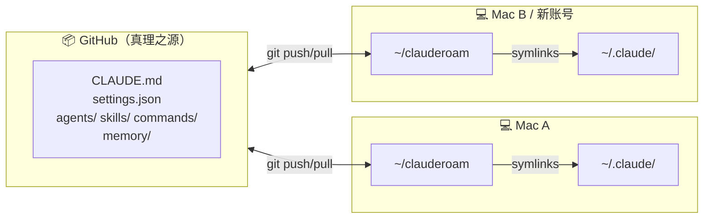

<div align="center">

# clauderoam

**让你的 Claude Code 配置漫游 —— 跨 Mac、跨账号、跨设备。**

[](LICENSE)
[](clauderoam)
[]()
[]()

[English](./README.md) · [文档](./docs) · [示例](./examples)

</div>

---

Claude Code 的 `~/.claude/` 目录里装着你所有的定制 —— `CLAUDE.md`、subagent、slash 命令、auto-memory。换 Mac，全没了。换 Claude 账号，也全没了。

**clauderoam 把可移植的部分放进 git，symlink 回来，让你的配置自由漫游。**

## 安装

```bash
git clone https://github.com/YunyueLi/clauderoam.git ~/clauderoam
cd ~/clauderoam && ./clauderoam init
```

就这两行。`init` 会交互式生成你的 `CLAUDE.md` 并 symlink 到 `~/.claude/`。重启 Claude Code，配置立即生效。

第二台设备，同样两行。

## 工作原理



Claude Code 照常读取 `~/.claude/` —— 它不知道（也不在乎）那些是 symlink。换账号只会替换 `.credentials.json`，其他配置原地不动。

## 命令

| 命令 | 作用 |
|---|---|
| `clauderoam init` | 交互式初次设置 —— 生成 `CLAUDE.md` + 安装 symlink |
| `clauderoam install` | （重新）创建 symlink，改动前先备份 |
| `clauderoam doctor` | 检查 symlink 指向是否正确、敏感文件是否泄漏 |
| `clauderoam sync` | 把 `~/.claude/projects/*/memory/` 快照到 `./memory/` |
| `clauderoam restore` | 反向恢复 memory（跨机器自动重写用户名） |
| `clauderoam push` | `sync` + `git commit` + `git push` 一条龙 |
| `clauderoam status` | 看仓库状态和 symlink 状态 |

`clauderoam help` 列出所有命令。

## 什么会被同步

| 同步到 git | 仅本机 |
|---|---|
| `CLAUDE.md` · `settings.json` | `.credentials.json` |
| `agents/` · `skills/` · `commands/` | `sessions/` · `shell-snapshots/` |
| `keybindings.json` | `projects/`（除 `memory/` 子目录） |
| `memory/`（快照） | `telemetry/` · `policy-limits.json` |

## 示例

开箱即用的 [agents](./examples/agents) 和 [slash 命令](./examples/commands)：

- `code-reviewer` — 聚焦的 diff 审查
- `git-helper` — 谨慎的 commit/branch/PR 操作
- `test-runner` — 自动找到一次改动该跑的测试
- `/commit` `/pr` `/sync` `/new-project` `/save`

```bash
cp examples/agents/code-reviewer.md agents/
git add agents/code-reviewer.md && git commit -m "feat: add code-reviewer" && git push
```

## 文档

- [Setup](./docs/setup.md) — 详细安装、卸载、本机覆盖
- [Multi-device](./docs/multi-device.md) — 新 Mac / iPad / iPhone 工作流
- [Multi-account](./docs/multi-account.md) — 换 Claude 账号不丢配置
- [Auto-sync](./docs/auto-sync.md) — 可选的自动同步 shell hook
- [FAQ](./docs/faq.md)

<details>
<summary><b>跟其他同类项目怎么比？</b></summary>

| 项目 | ⭐ | 同步方式 | 自动同步 | Doctor | Memory 快照 | 多账号 | 双语 | 技术栈 |
|---|---|---|---|---|---|---|---|---|
| **clauderoam** | — | git | 可选 shell hook | ✓ | ✓ + 用户名重写 | **✓ 主打** | ✓ 中英 | 纯 bash |
| [renefichtmueller/claude-sync](https://github.com/renefichtmueller/claude-sync) | 16 | git · iCloud · Dropbox · Syncthing · rsync | ✓ | 隐式 | 手动 | ✗ | ✗ | TypeScript |
| [balingsisi/claude-sync-tool](https://github.com/balingsisi/claude-sync-tool) | 11 | git | watch 模式 | ✓ | ✗ | ✗ | ✗ | CLI |
| [elizabethfuentes12/claude-code-dotfiles](https://github.com/elizabethfuentes12/claude-code-dotfiles) | 9 | git | ✓ shell function | ✗ | ✗ | ✗ | ✗ | shell |
| [zircote/.claude](https://github.com/zircote/.claude) | 24 | git (fork) | ✗ | ✗ | ✗ | ✗ | ✗ | dotfiles + 100+ agents |

**选 clauderoam** 如果你会换 Claude 账号、想要中英双语、偏爱纯 bash 零依赖，或者特别需要换 Mac 后能正确恢复（自动重写用户名）的 memory 快照。

**选 renefichtmueller/claude-sync** 如果你想要多种同步后端。

**选 zircote/.claude** 如果你主要想要一个精心策划的 agent 库。

</details>

<details>
<summary><b>FAQ</b></summary>

**会不会搞坏 Claude Code？** 不会。Symlink 对 Claude Code 透明 —— 它读 `~/.claude/` 和之前一样。

**仓库公开还是私有？** 同步 `memory/` 的话建议私有（可能含项目笔记）。否则公开也行。

**Linux / WSL 支持吗？** 应该支持，只用标准 Unix 工具（bash、git、rsync、ln）。

**是 Claude Code 二进制 portable 吗？** 不是 —— 这是 portable **配置**。要 U 盘版 Claude Code 看 [`SonnyTaylor/claude-code-portable`](https://github.com/SonnyTaylor/claude-code-portable)。

**怎么撤销？** `clauderoam install` 改动前会先把 `~/.claude/` 备份到 `~/.claude.bak.<时间戳>`，从那里恢复即可。

</details>

## 贡献

欢迎 Issue 和 PR —— 详见 [CONTRIBUTING.md](./CONTRIBUTING.md)。保持小、保持 bash。

## License

[MIT](./LICENSE)
