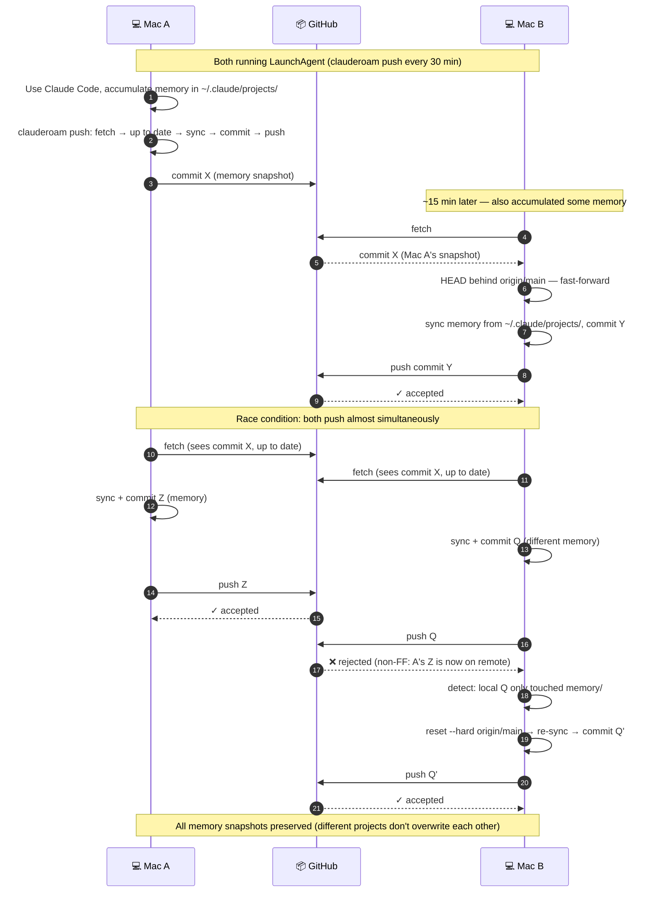

# Multi-device workflow

clauderoam's goal: any device, any time, pick up where you left off.

## What lives where

| Location | Contents | Synced via |
|---|---|---|
| `github.com/<you>/clauderoam` | Your portable config (CLAUDE.md, agents, commands, memory snapshots) | git |
| `github.com/<you>/<project>` | Each project's own code + `CLAUDE.md` + `.claude/` | git |
| `~/.claude/` (each machine) | Symlinks pointing into `~/clauderoam` | `clauderoam install` |

The two repo types stay separate on purpose. Your **identity and preferences** roam through `clauderoam`. Each **project's conventions** roam through its own repo.

## Adding a new Mac

```bash
brew install YunyueLi/tap/clauderoam                          # 1. install the CLI
git clone <your-config-repo> ~/clauderoam                     # 2. pull your data
clauderoam install                                            # 3. symlinks ~/.claude
clauderoam restore                                            # 4. optional: bring auto-memory back
```

Four commands, total. Your `CLAUDE.md`, agents, slash commands, and memory are all present.

> Make sure SSH key access to GitHub is set up first — see [setup.md](./setup.md#github-access-required-for-cloning-your-private-config-repo).

## iPhone / iPad

Mobile devices can't run scripts, but they can drive Claude Code remotely:

1. **Read past Claude conversations** — same account on the Claude iOS app syncs conversation history.
2. **Trigger work remotely** — install the [Claude GitHub App](https://github.com/apps/claude) on your project repos. Then in the GitHub iOS app, comment `@claude <task>` on any issue or PR. Claude runs in the cloud and opens a PR.
3. **Code review on the go** — same `@claude review` pattern in PR comments.

The principle: **iPhone never holds state**. Everything persistent lives in GitHub.

## Keeping devices in sync

| When | Where | Command |
|---|---|---|
| Start a session | Any device | `git pull` in project repos AND `~/clauderoam` |
| End a session | Any device | `git push` in project repos |
| End of day (or week) | Any Mac | `clauderoam push` — snapshot memory + push |

Want hands-off sync? See [auto-sync.md](./auto-sync.md) for a shell hook that runs `git pull` before every Claude Code session and pushes after.

## What multi-device sync actually looks like

Two Macs both with `clauderoam push` on a 30-min LaunchAgent. Here's what flows through GitHub over an hour:



Step 13 is the moment that used to require manual intervention. `clauderoam push` (v0.5.2+) handles it without bothering you, because memory is regenerable from `~/.claude/projects/` on each sync.
